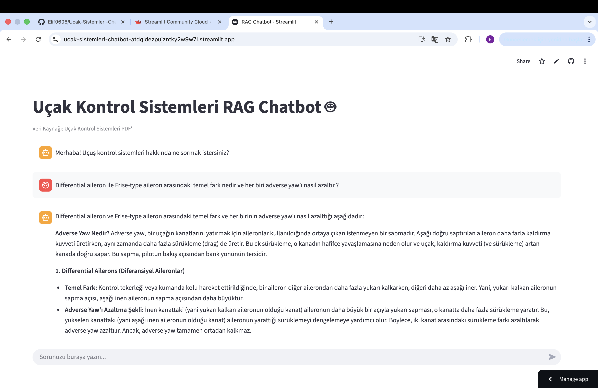
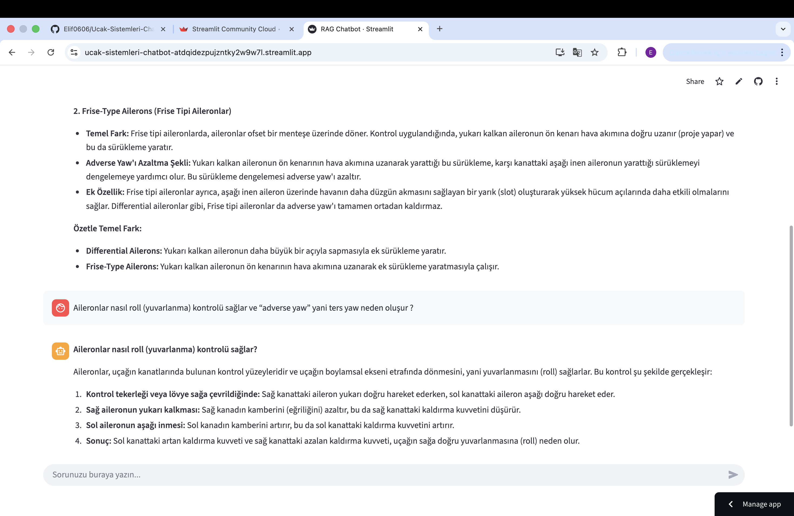
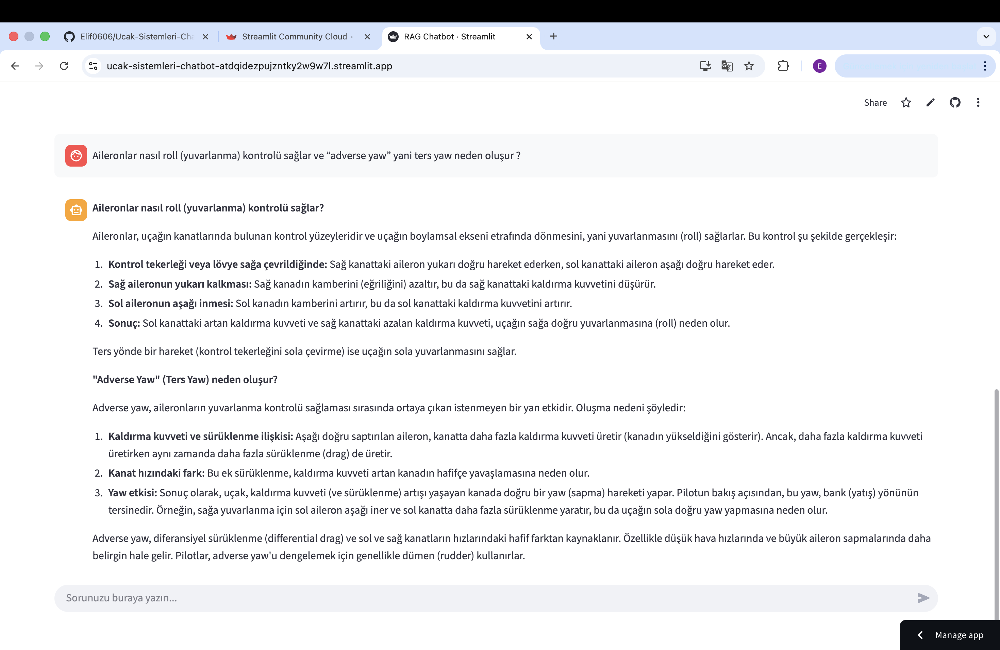

# Projenin Amacı : Uçak kontrol sistemleri hakkındaki teknik bir PDF belgesini kullanarak, kullanıcı sorularına bağlamsal ve doğru yanıtlar üreten, yapay zeka destekli bir soru-cevap asistanı (RAG Chatbot) oluşturmak.

# Veri Seti Hakkında Bilgi : Bu projede kullanılan veri seti, hazır bir PDF dokümanıdır ve toplanış/hazırlanışına dair herhangi bir ek işlem yapılmamıştır. Veri setimiz, teknik makalelerden derlenmiş, uçakların kontrol yüzeyleri (kanatçık, dümen, irtifa dümeni...), gibi kritik konuları kapsamaktadır. Amacı, chatbot'a uçak kontrol sistemleri alanında bir 'uzmanlık' kazandırmaktır.

# Kullanılan Yöntemler ve Teknolojiler : Yöntem: Retrieval-Augmented Generation (RAG).
LLM/Generation: Gemini 2.5 Flash.
Embedding: Google text-embedding-004.
Framework: LangChain.
Vektör DB: ChromaDB.
Arayüz: Streamlit.

# Elde Edilen Sonuçlar (Özet) : Geliştirilen chatbot, sadece sağlanan PDF dokümanı içindeki bilgilere dayanarak yanıt vermektedir. Yapılan testlerde, sistemin teknik sorulara hızlı, doğru ve kaynaktan destekli cevaplar ürettiği gözlemlenmiştir.

# Çalıştırma Kılavuzu : 

Gereksinimler: Python 3.10+ ve bir Terminal (Mac/Linux) veya Anaconda Prompt (Windows).

Repo'yu Klonlama: git clone [REPO LİNKİNİZ]

Sanal Ortam Kurulumu: python3 -m venv venv

Sanal Ortamı Aktifleştirme: source venv/bin/activate

Kütüphaneleri Kurma: pip install -r requirements.txt

API Anahtarını Tanımlama: export GEMINI_API_KEY="[ANAHTARINIZ]"

Uygulamayı Çalıştırma: streamlit run streamlit_app.py

Tarayıcıda Açma: Tarayıcıda http://localhost:8501 adresine gidin.

# Çözüm Mimarisi : 

Çözülen Problem: LLM'lerin sadece genel bilgiye sahip olma sorununu çözmek. Proje, LLM'in belirli bir teknik doküman (Uçak Kontrol Sistemleri PDF'i) hakkında doğru ve güncel bilgi vermesini sağlar.

RAG Mimarisi Detayı:

Yükleme ve Parçalama (Loading & Chunking): PDF, PyPDFLoader ile yüklenir ve RecursiveCharacterTextSplitter ile daha küçük, yönetilebilir parçalara (chunk) ayrılır.

Gömme (Embedding) ve İndeksleme: Parçalar, GoogleGenerativeAIEmbeddings modeli ile vektörlere dönüştürülür ve ChromaDB içine depolanır.

Erişim ve Yanıtlama (Retrieval & Generation): Kullanıcı sorusu geldiğinde, ChromaDB'den en alakalı metin parçaları çekilir. Bu parçalar, Gemini 2.5 Flash modeline bağlam (context) olarak sunularak nihai cevap üretilir.

# Web Arayüzü ve Kullanım Kılavuzu : 

Deploy Link: 

Çalışma Akışı: Kullanıcı, sohbet kutusuna teknik bir soru yazar. Streamlit, soruyu RAG zincirine gönderir. Ekran, cevap gelene kadar "Cevap aranıyor..." spinner'ı gösterir. Cevap geldiğinde sohbet geçmişine eklenir.

Kabiliyetleri Test Etme (Örnek Sorular): 

1. Aileronlar nasıl roll (yuvarlanma) kontrolü sağlar ve “adverse yaw” yani ters yaw neden oluşur ?

2. Differential aileron ile Frise-type aileron arasındaki temel fark nedir ve her biri adverse yaw’ı nasıl azaltır ?

3. Stabilator ile geleneksel elevator arasındaki fark nedir ve antiservo tab stabilator üzerinde nasıl bir etki yapar ?

4. Flap türlerinden (plain, split, slotted, Fowler) dört temelini sayın ve Fowler flap’in diğer flap türlerine göre en belirgin özelliği nedir ?

5. Trim sistemlerinin amacı nedir? Bir uçakta trim tab’ı “nose-down” pozisyonuna getirmenin kuyruk ve burun hareketi üzerindeki sonucu ne olur ?

Destekleyici Materyal: 

### Kabiliyet Testi (Ekran Görüntüsü)

Aşağıdaki görselde, chatbot'un dokümanımızdan yararlanarak <sorunuzu yazın> sorusuna verdiği cevabı görebilirsiniz:

### Kabiliyet Testi (Ekran Görüntüsü)

Aşağıdaki görselde, chatbot'un dokümanımızdan yararlanarak <sorunuzu yazın> sorusuna verdiği cevabı görebilirsiniz:

### Kabiliyet Testi (Ekran Görüntüsü)

Aşağıdaki görselde, chatbot'un dokümanımızdan yararlanarak <sorunuzu yazın> sorusuna verdiği cevabı görebilirsiniz:

